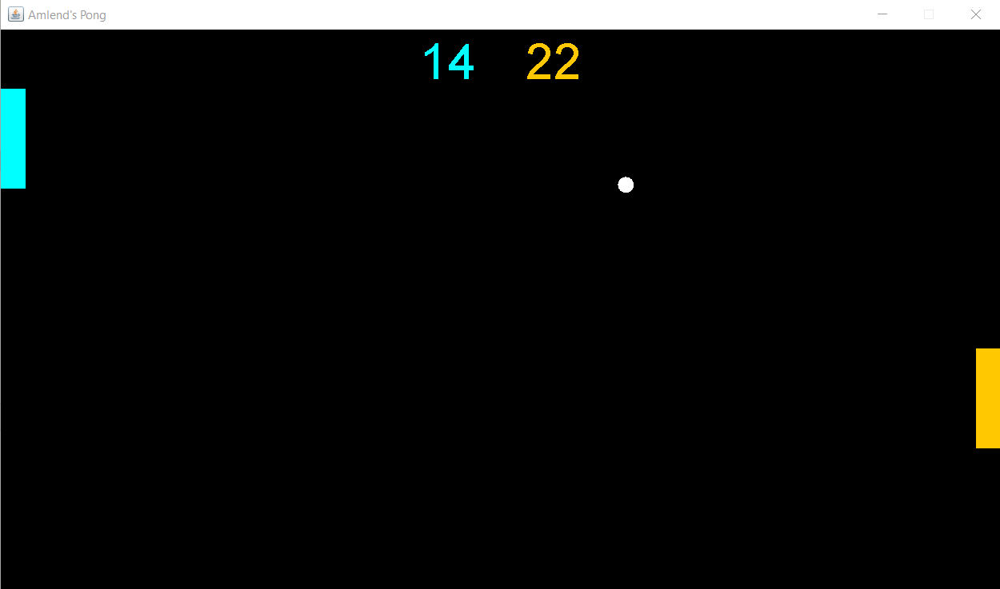

# Ping-Pong-Game
The classic Ping Pong game written in Java.
This is a simple GUI based game with the objective to hit the ball with the paddle and not let it leave the game screen. Player 1 can control its paddle using W and S keys. Player 2 can control its paddle using UP and DOWN ARROW keys.

